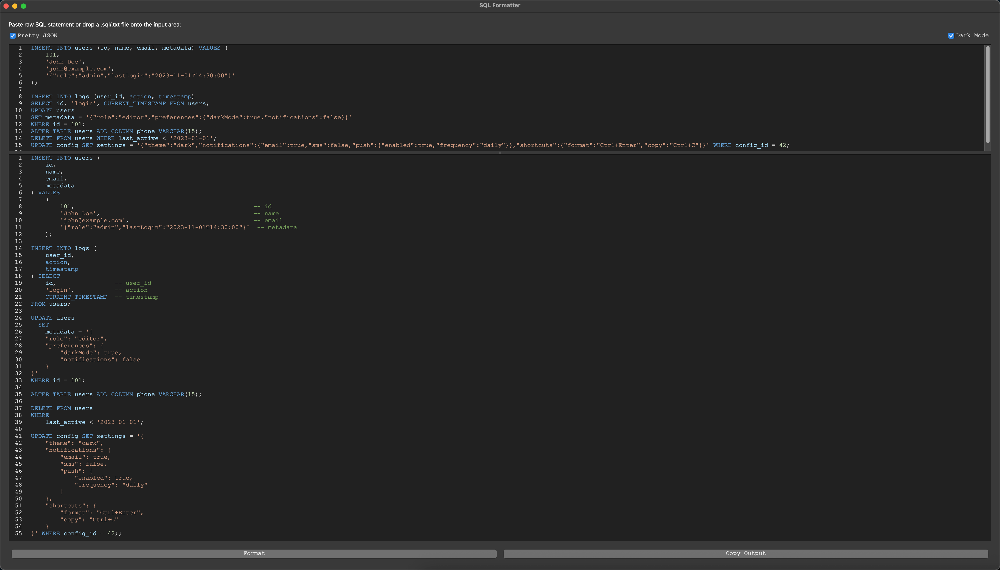

# Readable SQL Formatter

A PyQt5‐based GUI to automatically reformat messy SQL into clean, consistent, human‐readable blocks.



---

## Features

* **User-Friendly Interface**

  * Syntax highlighting for SQL in both input and output via QScintilla
  * Toggleable Dark Mode / Light Mode
  * Drag & Drop `.sql` / `.txt` files onto the input editor

* **Comprehensive SQL Block Formatting**

  * `INSERT … VALUES` (single and multi‐row with per‐value comments)
  * `INSERT … SELECT` (with per‐select‐item comments)
  * `UPDATE … SET` (including embedded JSON pretty‐print)
  * `SET @variable = …`
  * `CREATE TABLE` / `ALTER TABLE` / `DELETE FROM`
  * `DROP TABLE` / `DROP INDEX`
  * `CASE WHEN THEN … END`

* **Persistent Settings**
  * Remembers Last SQL formatted 
  * Remembers Dark Mode & Pretty JSON toggle between sessions
  * Remembers window size/position and QSplitter state

* **Convenience**

  * Auto‐Format on Startup (formats any cached SQL from the last session)
  * Press Ctrl + Enter (or Cmd + Enter on macOS) to format instantly
  * “Copy Output” button for quick sharing

* **Error Handling**

  * Formatting errors are shown inline in the output block, allowing subsequent statements to still be formatted

---

## Installation & Setup

### 1. Automatic (Recommended)

```bash
git clone [https://github.com/Ameer-Jamal/readableSQL.git](https://github.com/Ameer-Jamal/readableSQL.git)
cd readableSQL
python3 app.py
```

> **Note:** `app.py` will auto‐install PyQt5 and QScintilla if they are missing.

### 2. Manual Virtual Environment (Optional)
```bash
pyenv local 3.12.0
python3.12 -m venv venv
source venv/bin/activate
pip install -r requirements.txt
python app.py
```
### 3. Manual pip Install (if auto‐install fails)
```bash
pip install -r requirements.txt
python app.py
```
---

## Running Tests

A robust pytest suite validates all SQL formatting rules. To run:
```bash
pytest
```
---

## Requirements

* Python 3.12
* PyQt5 ≥ 5.15
* QScintilla ≥ 2.13

See `requirements.txt` for exact version pins.

---

## Contributing

Contributions are welcome! Feel free to open issues or pull requests to improve formatting rules or UI features.

---

## License
Copyright © 2025 Ameer Jamal <br>
This project is licensed under the [Custom Non-Commercial License](LICENSE) <br>
This project is open for personal or academic use only.
Commercial use, redistribution, or integration into proprietary products is prohibited without prior written permission.
